# Loan Billing System
## Overview
A comprehensive billing system for managing dynamic loan products with flexible repayment schedules. The system supports configurable loan terms, payment frequencies (weekly/monthly), and automated delinquency tracking through schedulers. **This service focuses purely on billing operations and does not perform customer validation - it processes loan requests as received from downstream services.**

## Quick Start

### Prerequisites
- Go 1.21 or later
- Docker and Docker Compose
- Make (optional, but recommended)

### Setup with Makefile (Recommended)
```bash
# Complete setup - provisions all resources, database, and starts services
make setup

# Check status of all services
make status

# Run tests
make test
```

### Manual Setup
```bash
# 1. Start all services (MySQL + Billing Engine)
docker compose up -d --build

# 2. Check status
docker compose ps

# 3. Test API
curl http://localhost:9006/health
```

### Available Make Commands
```bash
make help                 # Show all available commands
make setup               # Complete setup (recommended for first time)
make dev-setup           # Setup development environment
make docker-up           # Start Docker containers
make docker-down         # Stop Docker containers
make db-setup            # Setup database and tables
make db-reset            # Reset database
make build               # Build the application
make run                 # Run the application
make test                # Run all tests
make test-coverage       # Run tests with coverage
make clean               # Clean up build artifacts
make status              # Show status of all services
```

### Configuration
The system uses the following default configuration:
- **Database**: MySQL 8.0 on port 3306
- **Application**: Runs on port 9006
- **Database Name**: billing_engine
- **Database User**: billing_admin

You can override these by setting environment variables before running make commands.

## Business Rules
### Loan Structure (Dynamic)
- **Principal Amount**: Configurable per loan (amount disbursed to customer)
- **Interest Rate**: Configurable per loan (decimal, e.g., 0.10 for 10%)
- **Interest Amount**: Calculated as principal_amount × interest_rate
- **Loan Duration**: Configurable number of installments
- **Payment Frequency**: Weekly or Monthly
- **Installment Amount**: (Principal + Interest) ÷ Number of Installments
- **Outstanding Amount**: Tracked centrally in loan_summaries table

### Payment Rules
- **Exact Payment Enforcement**: Borrowers must pay exact amounts only
- **Overdue Payment Priority**: If overdue installments exist, customer must pay ALL overdue installments at once
- **Next Installment Payment**: If no overdue installments, customer can pay exactly one next pending installment
- **No Partial Payments**: All payments must match required amounts exactly
- **Payment Tracking**: installment_paid field tracks payment status per installment

### Delinquency Rules
- **Overdue Definition**: installment_due_date < current_date AND status = 'PENDING'
- **Status-Based Tracking**: Uses installment status (PENDING/PAID) for payment tracking

## Database Design (ERD)

```mermaid
erDiagram
    users {
        INT id PK
        VARCHAR customer_id UK "36 chars"
        VARCHAR name "255 chars"
        VARCHAR email "255 chars"
        VARCHAR phone "50 chars"
        TIMESTAMP created_at
        TIMESTAMP updated_at
        TIMESTAMP deleted_at
    }

    disbursement_details {
        INT id PK
        VARCHAR loan_id UK "50 chars"
        VARCHAR customer_id "36 chars"
        DATE disbursement_date
        DECIMAL disbursed_amount "15,2"
        CHAR disbursed_currency "3 chars, default IDR"
        VARCHAR status "100 chars"
        TIMESTAMP created_at
        VARCHAR created_by "255 chars"
        TIMESTAMP updated_at
        VARCHAR updated_by "255 chars"
        TIMESTAMP deleted_at
    }

    loan_summaries {
        INT id PK
        VARCHAR loan_id UK "50 chars"
        VARCHAR customer_id "36 chars"
        DECIMAL principal_amount "15,2"
        DECIMAL interest_amount "15,2"
        DECIMAL outstanding_amount "15,2"
        INT no_of_installment
        VARCHAR installment_unit "100 chars"
        DECIMAL installment_amount "15,2"
        DECIMAL effective_interest_rate "5,4"
        VARCHAR status "100 chars"
        DATE loan_start_date
        TIMESTAMP created_at
        VARCHAR created_by "255 chars"
        TIMESTAMP updated_at
        VARCHAR updated_by "255 chars"
        TIMESTAMP deleted_at
    }

    payment_schedules {
        INT id PK
        VARCHAR loan_id "50 chars"
        INT installment_number
        DECIMAL installment_amount "15,2"
        DATE installment_due_date
        DECIMAL installment_paid "15,2, default 0"
        VARCHAR status "100 chars, default PENDING"
        CHAR currency "3 chars, default IDR"
        TIMESTAMP created_at
        VARCHAR created_by "255 chars"
        TIMESTAMP updated_at
        VARCHAR updated_by "255 chars"
        TIMESTAMP deleted_at
        VARCHAR deleted_by "255 chars"
    }

    payment_schedule_histories {
        INT id PK
        INT schedule_id
        VARCHAR loan_id "50 chars"
        VARCHAR action "100 chars"
        INT installment_number
        DECIMAL installment_amount "15,2"
        DATE installment_due_date
        VARCHAR status "100 chars"
        CHAR currency "3 chars, default IDR"
        TIMESTAMP created_at
        VARCHAR created_by "255 chars"
    }

    users ||--o{ disbursement_details : "customer_id"
    disbursement_details ||--|| loan_summaries : "loan_id"
    loan_summaries ||--o{ payment_schedules : "loan_id"
    payment_schedules ||--o{ payment_schedule_histories : "schedule_id"
```

## Database Schema
### 1. Users Table ( For Reference Only)
```sql
CREATE TABLE users (
    id BIGINT PRIMARY KEY AUTO_INCREMENT,
    customer_id VARCHAR(36) UNIQUE NOT NULL,
    name VARCHAR(255),
    email VARCHAR(255),
    phone VARCHAR(50),
    created_at TIMESTAMP DEFAULT CURRENT_TIMESTAMP,
    updated_at TIMESTAMP DEFAULT CURRENT_TIMESTAMP ON UPDATE CURRENT_TIMESTAMP,
    deleted_at TIMESTAMP NULL
);

CREATE INDEX idx_users_customer_id ON users (customer_id);
```
*Note: This table is optional and only for reference. The billing system accepts any customer_id provided by downstream services.*

### 2. Disbursement Detail Table
```sql
CREATE TABLE disbursement_details (
    id BIGINT PRIMARY KEY AUTO_INCREMENT,
    loan_id VARCHAR(36) UNIQUE NOT NULL,
    customer_id VARCHAR(36) NOT NULL,
    disbursement_date TIMESTAMP NOT NULL,
    disbursed_amount DECIMAL(15,2) NOT NULL,
    disbursed_currency CHAR(3) DEFAULT 'IDR',
    status VARCHAR(100) NOT NULL,
    created_at TIMESTAMP DEFAULT CURRENT_TIMESTAMP,
    created_by VARCHAR(255),
    updated_at TIMESTAMP DEFAULT CURRENT_TIMESTAMP ON UPDATE CURRENT_TIMESTAMP,
    updated_by VARCHAR(255),
    deleted_at TIMESTAMP NULL
);

CREATE INDEX idx_disbursement_details_created_at ON disbursement_details (created_at);
CREATE INDEX idx_disbursement_details_status ON disbursement_details (status);
CREATE INDEX idx_disbursement_details_customer_id ON disbursement_details (customer_id);
```

### 3. Loan Summary Table
```sql
CREATE TABLE loan_summaries (
    id BIGINT PRIMARY KEY AUTO_INCREMENT,
    loan_id VARCHAR(36) UNIQUE NOT NULL,
    customer_id VARCHAR(36) NOT NULL,
    principal_amount DECIMAL(15,2) NOT NULL,
    interest_amount DECIMAL(15,2) NOT NULL,
    outstanding_amount DECIMAL(15,2) NOT NULL,
    no_of_installment INT NOT NULL,
    installment_unit VARCHAR(100) NOT NULL, -- 'week' or 'month'
    installment_amount DECIMAL(15,2) NOT NULL,
    effective_interest_rate DECIMAL(5,4) NOT NULL,
    dpd INT DEFAULT 0,
    status VARCHAR(100) NOT NULL, -- 'PENDING', 'PAID' and 'DELINQUENT'
    loan_start_date DATE NOT NULL,
    created_at TIMESTAMP DEFAULT CURRENT_TIMESTAMP,
    created_by VARCHAR(255),
    updated_at TIMESTAMP DEFAULT CURRENT_TIMESTAMP ON UPDATE CURRENT_TIMESTAMP,
    updated_by VARCHAR(255),
    deleted_at TIMESTAMP NULL,
    FOREIGN KEY (loan_id) REFERENCES disbursement_details(loan_id)
);

CREATE INDEX idx_loan_summaries_created_at ON loan_summaries (created_at);
CREATE INDEX idx_loan_summaries_customer_id ON loan_summaries (customer_id);
CREATE INDEX idx_loan_summaries_status ON loan_summaries (status);
CREATE INDEX idx_loan_summaries_dpd ON loan_summaries (dpd);
CREATE INDEX idx_loan_summaries_installment_unit ON loan_summaries (installment_unit);
```

### 4. Payment Schedule Table
```sql
CREATE TABLE payment_schedules (
    id BIGINT PRIMARY KEY AUTO_INCREMENT,
    loan_id VARCHAR(36) NOT NULL,
    installment_number INT NOT NULL,
    installment_amount DECIMAL(15,2) NOT NULL,
    installment_due_date DATE NOT NULL,
    outstanding_amount DECIMAL(15,2) NOT NULL,
    outstanding_paid DECIMAL(15,2) NOT NULL,
    status VARCHAR(100) DEFAULT 'PENDING', -- 'PENDING' or 'PAID'
    currency CHAR(3) DEFAULT 'IDR',
    created_at TIMESTAMP DEFAULT CURRENT_TIMESTAMP,
    created_by VARCHAR(255),
    updated_at TIMESTAMP DEFAULT CURRENT_TIMESTAMP ON UPDATE CURRENT_TIMESTAMP,
    updated_by VARCHAR(255),
    deleted_at TIMESTAMP NULL,
    deleted_by VARCHAR(255),
    FOREIGN KEY (loan_id) REFERENCES disbursement_details(loan_id)
);

CREATE INDEX idx_payment_schedules_loan_id ON payment_schedules (loan_id);
CREATE INDEX idx_payment_schedules_due_date ON payment_schedules (installment_due_date);
CREATE INDEX idx_payment_schedules_status ON payment_schedules (status);
CREATE INDEX idx_payment_schedules_outstanding ON payment_schedules (outstanding_amount);
CREATE UNIQUE INDEX idx_payment_schedules_loan_installment ON payment_schedules (loan_id, installment_number);
```

### 5. Payment Schedule History Table
```sql
CREATE TABLE payment_schedule_histories (
    id BIGINT PRIMARY KEY AUTO_INCREMENT,
    schedule_id BIGINT NOT NULL,
    loan_id VARCHAR(36) NOT NULL,
    action VARCHAR(100) NOT NULL,
    installment_number INT NOT NULL,
    installment_amount DECIMAL(15,2) NOT NULL,
    installment_due_date DATE NOT NULL,
    outstanding_amount DECIMAL(15,2) NOT NULL,
    status VARCHAR(100),
    currency CHAR(3) DEFAULT 'IDR',
    dpd INT DEFAULT 0,
    created_at TIMESTAMP DEFAULT CURRENT_TIMESTAMP,
    created_by VARCHAR(255),
    FOREIGN KEY (schedule_id) REFERENCES payment_schedule(id),
    FOREIGN KEY (loan_id) REFERENCES disbursement_details(loan_id)
);

CREATE INDEX idx_payment_schedule_histories_schedule_id ON payment_schedule_histories (schedule_id);
CREATE INDEX idx_payment_schedule_histories_loan_id ON payment_schedule_histories (loan_id);
CREATE INDEX idx_payment_schedule_histories_created_at ON payment_schedule_histories (created_at);
```

## API Specifications
### 1. Disbursement API
**Endpoint**: `POST /v1/disbursement`
**Request Body**:
```json
{
  "principal_amount": 5000000.00,
  "interest_rate": 0.10,
  "installment_unit": "week",
  "number_of_installment": 50,
  "start_date": "2025-08-31T11:43:00Z",
  "customer_id": "12312312"
}
```
**Response (Success)**:
```json
{
  "status": "success",
  "data": {
    "loan_id": "loan_123456789",
    "customer_id": "12312312",
    "disbursed_amount": 5000000.00,
    "installment_amount": 110000.00,
    "outstanding_amount": 5500000.00,
    "installment_unit": "week",
    "number_of_installment": 50,
    "disbursement_date": "2025-08-31T11:43:00Z",
    "first_due_date": "2025-09-07T00:00:00Z",
    "final_due_date": "2026-08-23T00:00:00Z"
  }
}
```
**Business Logic**:
1. Validate loan parameters (amounts, interest_rate, installment_unit, number_of_installments)
2. Generate unique loan_id with "loan_" prefix
3. Calculate interest_amount = principal_amount * interest_rate
4. Calculate installment_amount = (principal_amount + interest_amount) / number_of_installments
5. Calculate due dates based on installment_unit (weekly/monthly)
6. Create records in `disbursement_details` and `loan_summaries`
7. Generate payment schedules in `payment_schedules` table
8. Set initial outstanding_amount to (principal_amount + interest_amount)
9. All financial calculations use decimal precision to avoid floating-point errors

### 2. Repayment API
**Endpoint**: `POST /v1/repayment`
**Request Body**:
```json
{
  "loan_id": "loan_123456789",
  "payment_amount": 220000.00
}
```
**Response (Success)**:
```json
{
  "status": "success",
  "data": {
    "loan_id": "loan_123456789",
    "payment_amount": 220000.00,
    "installments_paid": 2,
    "installment_amount": 110000.00,
    "remaining_installments": 48,
    "outstanding_amount": 5280000.00,
    "next_due_date": "2025-09-21",
    "payment_date": "2025-09-15T10:30:00"
  }
}
```

**Business Logic**:
1. Validate loan exists in billing system
2. Get overdue installments (installment_due_date < NOW() AND status = 'PENDING')
3. If overdue installments exist:
   - Customer must pay ALL overdue installments with exact total amount
   - Calculate required_amount = sum of all overdue installment amounts
4. If no overdue installments:
   - Customer can pay the next single pending installment with exact amount
   - Get next pending installment (status = 'PENDING', earliest due date)
5. Validate payment amount equals required amount exactly
6. If valid:
   - Update `payment_schedules` records (mark as PAID, set installment_paid = installment_amount)
   - Update outstanding_amount in `loan_summaries`
   - Create history records in `payment_schedule_histories`
7. If all installment statuses are marked as `PAID`, the loan summary status will be updated to `PAID`
8. Exact payment enforcement: no partial payments allowed

### Get Outstanding Balance
**Endpoint**: `GET /v1/loans/{loan_id}/outstanding`

**Response**:
```json
{
  "status": "success",
  "data": {
    "loan_id": "loan_123456789",
    "customer_id": "12312312",
    "loan_details": {
      "installment_unit": "week",
      "installment_amount": 110000.00,
      "total_installments": 50
    },
    "outstanding_amount": 3300000.00,
    "overdue_amount": 220000.00,
    "overdue_installments": 2,
    "paid_installments": 20,
    "remaining_installments": 30
  }
}
```

### Check Delinquency Status
**Endpoint**: `GET /v1/loans/{loan_id}/delinquency`

**Response**:
```json
{
  "status": "success",
  "data": {
    "loan_id": "loan_123456789",
    "customer_id": "12312312",
    "is_delinquent": true,
    "installment_unit": "week",
    "overdue_installments": 2,
    "overdue_amount": 220000.00,
    "outstanding_amount": 3300000.00,
    "required_payment_amount": 220000.00
  }
}
```

### Get Loan Schedule
**Endpoint**: `GET /v1/loans/{loan_id}/schedule`

**Response**:
```json
{
  "status": "success",
  "data": {
    "loan_id": "loan_123456789",
    "loan_summary": {
      "installment_unit": "week",
      "total_installments": 50,
      "installment_amount": 110000.00,
      "disbursed_amount": 5000000.00,
      "outstanding_amount": 3300000.00
    },
    "schedule": [
      {
        "installment_number": 1,
        "due_date": "2025-09-07T00:00:00Z",
        "installment_amount": 110000.00,
        "installment_paid": 110000.00,
        "status": "PAID",
        "paid_date": "2025-09-07T10:30:00Z"
      },
      {
        "installment_number": 2,
        "due_date": "2025-09-14T00:00:00Z",
        "installment_amount": 110000.00,
        "installment_paid": 0.00,
        "status": "PENDING",
        "paid_date": null
       }
    ]
  }
}
```
